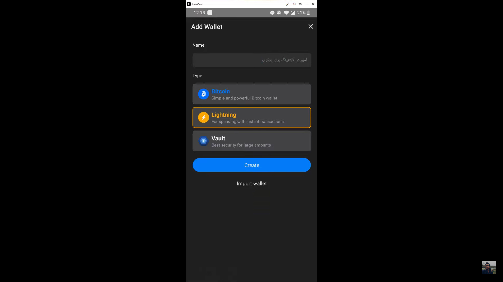
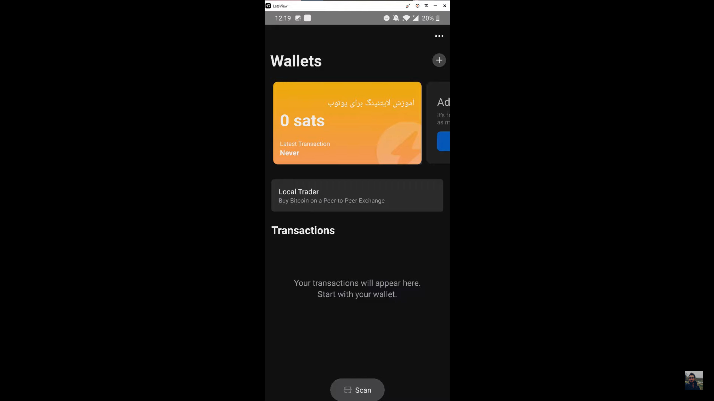

**ضیا:** سلام دوستان. می‌خوایم با همدیگه یه والت ساده‌ی لایتنینگی نصب کنیم، استفاده کنیم ازش و ببینیم چجوریه. تراکنش انجام بدیم، یه بازیابی انجام بدیم، یه والت خیلی ساده و راحت نصب کنیم.

با این حال این والت‌ها ممکنه یه دردسرها و مشکلاتی داشته باشند، بهشون اشاره می‌کنم و توضیحشون میدم که همه‌ی نکات رو در موردشون بدونید. بریم واسه‌ی نصب والت.

خب شما اینجا این تصویر رو دارد می‌بینید و این تصویر چیه؟ ما الان 6 تا والت اینجا داریم همراه با اپ استور که کاریش نداریم فعلا. این 6 تا والتی که دارید می‌بینید، چهار تا سمت راست و دو تا سمت چپ، والت‌های مختلفی واسه لایتنینگ هست. من از همه‌ی این 6 تا استفاده می‌کنم ولی شما به همه‌ی این‌ها نیاز ندارید، شاید یکی دوتا رو بیشتر نیاز داشته باشید.

خب والت‌هایی که سمت راست داریم می‌بینیم والت‌های حرفه‌ای‌تری هستند و یه مقدار فنی‌تراند و یه مقدار دانش بیشتری نیاز دارند، اما مزیت‌های بیشتری هم دارند، قابلیت‌های بیشتری دارند و امکان اینکه دارایی رو پیش خودتون نگه دارید رو برای ما فراهم می‌کنند و خیلی والت‌های خوبی‌اند. خود من توصیه می‌کنم که از این چهارتایی که سمت راست هستند برای کاربری اصلیتون استفاده کنید.

اما والت‌هایی که سمت چپ هستند برای کاربری راحت خیلی بهتر هستند که شما مثلا واسه‌ی عیدی دادنی باشه، واسه‌ی تیپ دادنی باشه، هدیه دادن باشه و اینجور کارها می‌تونید از والت‌های سمت چپ استفاده کنید.

واسه همین الان این دو تا والت خیلی ساده رو نشونتون میدم که چجوری نصب و استفادشون کنید. اول بلووالت رو توضیح میدم و بعد والت آف ساتوشی که مشکلی رنگه رو توضیح میدم.

برای نصب کردن والت باید بریم گوگل پلی یا اگه آیفون باشیم باید بریم اپ استور. بعد می‌نویسیم BlueWallet. همیشه دقت کنید که لینک اصلی رو نصب کنید. مثلا این الان 50 هزارتا دانلود داره و به نظر میاد که اصلیه باشه.

یه کار دیگه که می‌تونید بکنید اینه که برید توی وب سایت بلووالت و از اونجا لینک گوگل پلی رو پیدا کنید و از اونجا وارد گوگل پلی بشید. بعد از اینکه نصب کردیم، وارد می‌شیم.

اگر کیف پول شما رنگش سفیده و مال من مشکیه، دلیلش به خاطر اینه که تم گوشیه من مشکیه وگرنه جفتش یکیه.

خب ما یه والت سریع می‌سازیم. Add Wallet رو می‌زنیم. بعد گزینه‌ی Lightning رو انتخاب می‌کنیم. با اینکه ما می‌تونیم از این والت برای والت بیت‌کوین در حالت معمولی یا والت چند امضایی هم استفاده کنیم اما اینجا ما لایتنینگ رو نیاز داریم که استفاده کنیم. اسم هم براش انتخاب می‌کنیم: آموزش لایتنینگ برای یوتیوب. و در نهایت Create.

خب این والت وقتی ساخته می‌شه اینجا تصویر احتمالا سیاه می‌شه. بله. پیش من الان تصویر هست ولی واسه شما نشون نمیده. اجازه‌ی اسکرین شات به هیچ وجه نمیده چون این قسمت امنیتیه و داره کد بکاپ شما رو نشون میده.

می‌نویسه Your wallet has been created. Please save this wallet backup. میگه این بکاپ رو ذخیره کنید. این بکاپ رو هر کسی داشته باشه می‌تونه به والت شما دسترسی پیدا کنه. واسه همین من فعلا اون رو ذخیره می‌کنم و میریم مرحله‌ی بعد.

الان تصویر دوباره برگشت. خب. ما الان یه والت ساختیم و بکاپش رو هم ذخیره کردیم که به شکل یه کد QR code یا متنی هستش.

ما الان این والت رو داریم. می‌تونیم Receive داشته باشیم، می‌تونیم Send داشته باشیم و به همین سادگی می‌تونیم شروع کنیم به کار کردن باهاش.

مثلا الان می‌خوایم مقداری دریافت کنیم. روی Receive می‌زنیم. می‌پرسه بکاپتون رو ذخیره کردید؟ من می‌گم بله ذخیره کردم. اگه ذخیره نکردید باید حتما اول ذخیرش کنید.

خب چه مقدار ساتوشی؟ ساتوشی کوچکترین واحد بیت‌کوین هست. هر 100 میلیون ساتوشی میشه یک بیت‌کوین. من هزارتا ساتوشی می‌خوام دریافت کنم.

عدد رو وارد می‌کنیم و Create Invoice رو می‌زنیم، می‌پرسه می‌خوای نوتیفیکیشن هم دریافت کنی؟ میگم بله.

حالا واسه من یک Invoice می‌سازه به این شکل. الان این Invoice رو که می‌بینید این QR code و یا این متنی که اینجا دارید می‌بینید، اگر بفرستید واسه‌ی کسی، می‌تونه واستون روی لایتنینگ، بیت‌کوین بفرسته.

بذارید من خودم از یه والت دیگه که اینجا دارم بفرستم. متن کد رو کپی می‌کنم. اونطرف پیست می‌کنم، و ارسال شد. این هم از 1000 ساتوشی که در بلووالت دریافت کردم. به همین سادگی انتقال داده شد.

با این حال ما می‌خوایم ببینیم که اگر کیف پولمون پاک شد، یه وقت حذف شد، گوشی سوخت یا اتفاقی افتاد، چجوری باید اون رو بازیابیش کنیم. چون که ما توی بلووالت ایمیل و پسوورد نداریم و اغلب والت‌های بیت‌کوین اینجوری هستند.

فکرشو بکنید الان این کیف پول پاک شده. من خودم الان اینجا پاکش می‌کنم. پاک شد و من دیگه اینجا کیف پولی ندارم. دوباره Create Wallet رو می‌زنم و اینجا این گزینه‌ی Import Wallet که این پایین هست رو انتخاب می‌کنم.

اینجا صفحه دوباره برای شما سیاه می‌شه و فقط من می‌بینمش. اون کدی که برای بازیابی بود و یادداشتش کرده بودم رو اینجا وارد می‌کنم. یا می‌تونید اگر عکسش رو دارید اینجا اسکنش کنید. Import رو می‌زنیم و مجددا وارد والتمون می‌شیم.

این کل جزئیات بلووالت بود. حالا میریم سراغ والت ساتوشی. این یه ذره متفاوت‌تر کار می‌کنه ولی مفهوم در کل شبیه به همه.

والت ساتوشی رو هم مثل بلووالت از گوگل پلی دانلود میکنیم. حتما مطمئن بشید که نرم افزار اصلیه و جعلی نیست. وارد والت می‌شیم. Start رو می‌زنیم. الان والت ساخته شد. به همین سادگی.

نکته اینه که اگر شما بخواین از این والت برای دراز مدت استفاده کنید باید اکانت بسازید.

اون سه نقطه‌ی بالا سمت راست رو می‌زنید و بعد گزینه‌ی Log in to Backup رو بزنید.

حالا اینجا ما کافیه یه ایمیل وارد کنید. من ایمیل خودم رو وارد می‌کنم. الان میگه که من دو تا کلمه برای ایمیلت فرستادم. اون دو تا کلمه رو به من بگو. خب من الان ایمیلم رو چک کردم و اون دو تا کلمه رو اینجا وارد می‌کنم. Login رو می‌زنم و تمام. والت من ساخته شد. الان دیگه این والت لاگین شده به اکانت من.

ما اینجا هم می‌خوایم مثل بلووالت یه مقدار ساتوشی دریافت کنیم. Receive رو می‌زنیم. مقدار رو تعیین می‌کنیم. مثلا 500 ساتوشی می‌خوایم دریافت کنیم که حدودا میشه 38 سنت.

خب الان این QR code رو می‌تونم بفرستم یا این متن پایین رو کپی کنم. الان میریم توی بلووالت و از اونجا به این والت انتقال میدیم. خودش فهمید که ما یه Invoice داریم و میگه که می‌خواین ازش استفاده کنید؟ من فعلا کنسل می‌زنم تا نشونتون بدم روندش چجوریه.

Send رو می‌زنم. Invoice رو پیست می‌کنم. مقدار ساتوشی رو می‌نویسه. Pay رو می‌زنم و انتقال انجام میشه. الان اگر برم توی والت ساتوشی می‌بینم که دریافت شده. به همین سادگی.

اگر این والت رو ما بخوایم بازیابی کنیم فرآیند یه مقدار پیچیده‌تری داره. خب از اونجایی که ما اینجا اکانت داریم و به ایمیل ما وصل شده این قسمت سبز رنگ، کافیه که شما ایملیتون رو وارد کنید و واسه‌ی ایمیل شما یه کد فرستاده میشه. اون وقت اون کد رو اسکن می‌کنید و والت بازیابی میشه، با این تفاوت که ممکنه بگه مثلا 24 ساعت صبر کنید تا بازیابی انجام بشه.

خب این بود نصب کیف پول بلووالت و والت ساتوشی برای استفاده از لایتنینگ. نکته‌ی خیلی مهمی وجود داره اینجا که باید توضیح بدم در رابطه با این دو تا کیف پول، اینکه این کیف پول‌ها امانی هستند، یعنی پول شما پیش اون شرکت نگهداری میشه. توی کیف پول بلووالت فقط قسمت لایتنینگش اینجوریه و برای قسمت‌های دیگه‌اش، دارایی کامل دست خود شما هستش ولی در قسمت لایتنینگش، دارایی شما پیش اون‌ها نگهداری می‌شه.

پس حتما یادتون باشه که توی این کیف پول‌ها مبلغ زیادی قرار ندید و اینکه برای مبالغ بیشتر، حتما از کیف پول‌های بهتری استفاده کنید که می‌تونه دارایی رو کامل پیش خودتون نگهداره.

اون کیف پول‌هایی که دارایی رو کامل پیش خودتون نگه می‌دارن شاید یکم سخت‌تر باشند مثل والت فینیکس که من استفاده می‌کنم.

با این حال واسه‌ی همه‌ی والت‌های دیگه هم در قسمت‌های آتی، آموزش قرار میدم. والت‌هایی مثل Breez، Phoneix، Muun wallet و غیره.

فعلا تا ویدیوهای بعدی.
