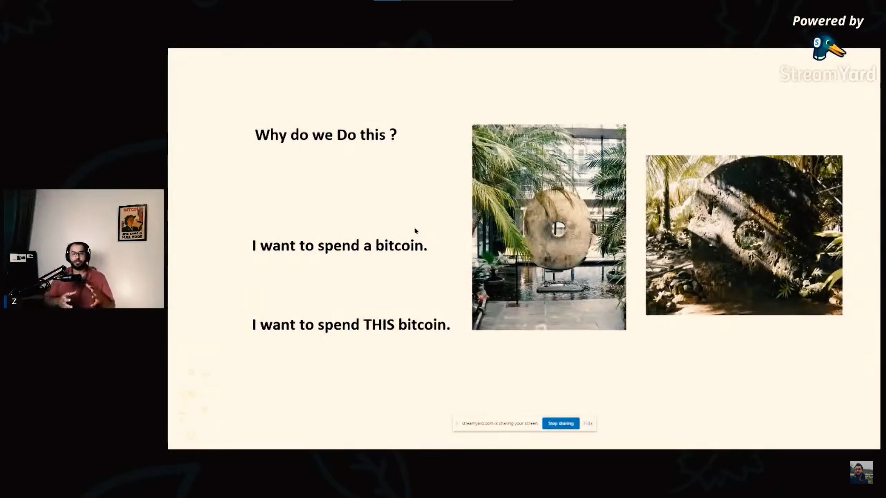

**سوال:** مگه یه بیت‌کوین مساوی با یه بیت‌کوین نیست؟ پس چجوریه که بعضی‌ها میگن بیت‌کوین فانجیبل نیست و بعضی بیت‌کوین‌ها لکه داراند؟

**ضیا:** این خیلی موضوع مهمیه و شاید خیلی‌ها متوجه این مسئله نباشند که شبکه‌ی بیت‌کوین شفافه و قابلیت رویته و هر تراکنشی توش قابل مشاهده است. مثلا اگه شما سال 2013 تراکنشی انجام داده باشید، اون تراکنش هنوز هست و فراموش نمیشه. همه چیز در شبکه‌ی بیت‌کوین ذخیره میشه.

پس وقتی ما این مسئله رو داریم اونوقت چجوری می‌تونیم بگیم که همه چیز ناشناس هست؟ نیست در واقع. شبکه‌ی بیت‌کوین ناشناس نیست، نیمه ناشناس یا شبه ناشناسه. الان توضیح میدم که چجوری.

برای اینکه بشه این موضوع رو بشه شرح داد، اول باید بفهمیم که UTXO چیه. یه مفهوم نسبتا پیچیده است و من سعی می‌کنم به ساده‌ترین حالت ممکن با یه سری تصویر شرح بدم.

ببینید تراکنش‌های بیت‌کوین اینجوری کار می‌کنند.

همین الان فکر کنم شما از دیدن این تصویر ترسیدید که هر کدوم از این‌ها از یه جا به یه جا وصل شده و من اگه بخوام از روی این تصویر توضیح بدم پیچیده میشه. بذارید یه جور دیگه توضیح بدم.

بیت‌کوین در هسته‌اش جوری که طراحی شده، در واقع تراکنش انجام نمیشه توش، یعنی تراکنش انجام میشه ولی تراکنشش به این معنی نیست که این سکه‌ی بیت‌کوین رو از این جیب بنداز توی اون جیب. به این حالت عمل نمی‌کنه. پس شبکه‌ی بیت‌کوین چجوری عمل می‌کنه؟

شبیه به این سنگ‌ها که توی تصویر می‌بینید. این سنگ‌ها اسمشون Rai stones عه. هزاران سال پیش توی یه روستایی اطراف نیوزلند و توی یه جزیره‌ی دور افتاده‌ای، مردم اون جزیره از این سنگ‌ها به عنوان پول استفاده می‌کردند. یعنی این سنگ پول بود. الان عکس سمت چپ که می‌بینید یکی از این سنگ‌هاست که توی یکی از بانک‌های کانادایی نگهداری میشه. یک اثر تاریخیه.

پس این سنگ‌ها پول بودند. این سنگ به این گندگی رو در اون دوران چجوری انتقال می‌دادند؟ چجوری انتقال مالکیت می‌دادند؟ این سنگ چون جابه‌جا نمیشد در واقع به درد پول بودن می‌خورد. کاری که می‌کردند این بود که می‌گفتند اهالی روستا جمع بشید، این سنگ الان مال احمد بود، به خاطر یه معامله‌ای که انجام دادند از این به بعد این سنگ مال علیه و همه متوجه می‌شدند که این سنگ تغییر مالکیت داده. سنگه تغییر نکرد. همون سنگه و همونجاست.

اون کسی که بیت‌کوین رو طراحی کرده، احتمالا ساتوشی ناکاموتو، از ماجرای این Rai stones ها احتمالا مطلع بوده. چون با بیت‌کوین شباهت داره.

پس ما وقتی میگیم تراکنش انجام شد، در واقع من نمیگم که یه بیت‌کوینی رو دارم خرج می‌کنم. میگم این بیت‌کوین رو می‌خوام خرج کنم. یعنی دقیقا واضحه که این رو می‌خوام خرج کنم و هر بیت‌کوینی رو هم خرج نمی‌کنم. یه بیت‌کوین خاصی رو انگار دارم خرج می‌کنم.

حالا Rai stones ها چجوری‌اند؟ یعنی خود تراکنش‌های بیت‌کوین چه شکلی‌اند؟ تراکنش‌های بیت‌کوین این شکلی‌اند. شبیه به این قلک‌ها.

یه مفهومی دارند به نام UTXO. مثلا ما توی قلک سمت چپ دو تا بیت‌کوین داریم. وقتی می‌خوایم این بیت‌کوین‌ها رو خرج کنیم چیکار باید بکنیم؟ باید اول قلک رو بشکونیم. بعد که قلک رو شکوندیم ما می‌خوایم یه بیت‌کوین بدیم به قلک نارنجیه که یه نفر دیگه است. چیکار می‌کنیم؟ یه دونه بیت‌کوین بر میداریم و میندازیم توی قلک نارنجیه که صاحبش یکی دیگه است. بعد اون یه دونه بیت‌کوین دومی رو بر میداریم و میندازیم توی یه قلک جدید که مال خودمونه.

این قلک جدیده یه آدرس جدید از کیف پول خودمونه که این یه بیت‌کوین برمی‌گرده بهش.

پس یعنی یه قلک داریم، اون رو میشکونیم. دو تا بیت‌کوین رو برمیداریم. یه دونه‌اش رو میندازیم توی قلک نارنجی و یه دونه‌ی دیگه رو که مال خودمونه و نمی‌خوایم خرج کنیم، میندازیم توی یه قلک دیگه. UTXO های بیت‌کوین مفهومش دقیقا یه همچین حالتیه.

ساتوشی این مفهوم رو این جوری کشیده، خیلی ساده، ولی اصلا کافی نیست و واسه همین ما باید بیشتر توضیحش بدیم. طبق این تصویر تراکنش یه سری ورودی داره که همون قلک‌های قبلی‌اند و بعدش یه سری خروجی داره که همون قلک‌های جدید‌اند. به این شکل کار میکنه.

اگه بخوام یه تصویر کامل‌تر بذارم این تصویر بهتریه. چیزی که انجام میده اینه که ما الان صدهزار ساتوشی داریم، بعد میخوایم که چهل هزار ساتوشی بدیم به یه نفر. یک خروجی داریم که چهل هزار ساتوشی داخلشه. یک قلک دیگه هم داریم که مال خودمونه احتمالا، چون نمیتونیم دقیقا متوجه این مسئله بشیم، که پنجاه هزار ساتوشی داخلشه، و یه تراکنش انجام میدیم.

حالا تو ستون بعدی می‌تونیم دوباره قلک خودمون رو بشکونیمش و دوباره توی دو بخش دیگه خرجش بکنیم. همینطوری قلک‌ها رو میشکونیم و به قلک‌های جدید منتقل می‌کنیم.

الان این یه تراکنشه که من همینطوری به صورت رندوم پیداش کردم. ببینید الان توی این آدرس 28.6 تا بیت‌کوین هست. طرف اومده به یه قلک جدیدی که آدرس جدید یه شخص دیگه باشه، 20 تا بیت‌کوین انداخته، 8 تا بیت‌کوین دیگه رو انداخته تو جیب خودش. از کجا می‌تونیم با قطعیت بگیم که انداخته تو جیب خودش؟ چون آدرس قبلی و آدرس بعدی یکسان هستند و خب این کار اشتباهیه چون خیلی کیف پول درب و داغونی داشته که این کار رو کرده.

خب الان همه‌ی این‌ها که توضیح دادیم یعنی چی؟ یعنی اینکه این قلک‌ها که میشکنه و به یکی دیگه انتقال داده می‌شه، مالکیتشون با این آدرس‌ها داره عوض میشه (مثل اون سنگ‌ها که مالکیتشون عوض میشه) و وقتی این‌ها از خودشون یک مسیری رو به جا میذارن، امکان رصد شدن و مطالعه شدن پیدا می‌کنند. امکان تحلیل شدن پیدا می‌کنند.

من الان همین تراکنش رو برداشتم گذاشتم توی یه ابزاری که سامورایی والت توسعه داده، اسمش OXT عه. من الان سعی می‌کنم بگردم دنبالش و ببینم کجا میره.

خب این شخص چیکار کرده؟ از 28 تا بیت‌کوین 20 تاش رو انتقال داده اینجا، بقیه‌اش رو هم انتقال داده اینجا. قبلش هم از یه جایی دریافت کرده. خب ما بقیه‌ی مسیر رو دنبال می‌کنیم. این 20 تا بعدش کجا رفته؟ از این 20 تا 19.5 تا اومده توی این آدرس و 0.5 بیت‌کوین هم اومده توی یه آدرس دیگه.

و همینطوری ما می‌تونیم مسیر رو ادامه بدیم و ببینیم که این به کجا فرستاده و بعدش نفر بعدی به کجا فرستاده و الی آخر.

مثلا اینجاها دیگه یه جای خاصی باید باشه که اینجوری شده یا احتمالش هست که اکسچنجی چیزی باشه. الان من اگه بتونم تشخیص بدم که این کدوم اکسچنجه، اون وقت می‌تونیم ببینیم که این شخص که الان از اینجا انتقال داده و از یه سری اشخاص رد شده، الان رسیده به یه اکسچنجی و اون اکسچنج احتمالا اطلاعات هویتی اون شخص آخر رو داره.

خب این چیه؟ این چیزی که الان شکل درخت تشکیل کرد و رسید به اینجا؟ این جابه‌جایی‌ها رصدپذیراند. ما می‌تونیم یه سری معنی برداشت کنیم از این مسئله که مثلا این شخص قبلی فرستاده برای بعدی و بعدی و بعدی. این چیزها توی بیت‌کوین وجود نداره و ما داریم معنی‌ای بهش می‌دیم.

فرض می‌ذاریم این شخصی که این رو انتقال داده احتمالا برای اون انتقال داده و همینطوری این فرض‌های خودمون رو تحمیل می‌کنیم به چیزی که داره توی شبکه اتفاق میفته و شما فکرش رو بکنید که الان یه بیت‌کوینی رو دریافت می‌کنید که دو تا مرحله قبل از شما فمیدند که دست یه تاجر مواد مخدر بوده، الان ممکنه که به خاطر اینکه همچین چیزی معلوم شده اون وقت بیت‌کوین شما کمتر ارزش گذاری بشه.

مثلا بیان بگن من این بیت‌کوین رو از تو نمی‌گیرم. چون مثلا روش یه کمی کوکائین خورده انگاری. چن قبلا از دست یه نفری رد شده که همچین کاری رو کرده.

این مفهوم اینه که ما بیت‌کوین‌ها رو از هم متمایز می‌کنیم، که اصلا چیز خوبی نیست و یه چیزیه که توی شبکه‌ی بیت‌کوین وجود نداره خودش ولی ما میایم تعریف و برداشت خودمون رو روی اون سوار می‌کنیم.

من وقتی میگم "ما" معنیش این نیست که من یا کس دیگه‌ای انجامش بده که ما بشناسیمش. کسایی که انجامش میدن شرکت‌هایی هستند به نام Chainalysis و BlockChainalysis که میان این‌ها رو سعی می‌کنند ردگیری کنند و در کنارش اگه دیتای اضافی‌ای داشته باشند، مثلا برن به یه اکسچنجی بگن آقای اکسچنج، این بیت‌کوین از شما رد شده، اطلاعاتش رو به من بگو که مال کی بود. وقتی این‌ها رو ترکیب بکنند با اطلاعات دیگه، میتونند یه سری تحلیل‌ها ارائه کنند و برای حوزه‌های قانونی مختلف، معنی‌های متفاوتی می‌تونه داشته باشه.

مثلا بیت‌کوین یه ایرانی ممکنه چیز جالبی نباشه برای یه اکسچنج خارجی. این تحلیل‌ها رو که این شرکت‌ها ارائه میکنند یه چیزهای فرضی و موهومی هست یه مقدار که خودشون به شبکه تحمیل می‌کنند و مثلا میان میگن که این بیت‌کوینه مشکل داره انگار. در صورتی که توی شبکه‌ی بیت‌کوین همه چی یکسانه و بیت‌کوین‌ها فرقی نمیکنند به جز این که مالک داره عوض میشه.

و به این شکل بحثی به نام لکه‌دار بودن کوین رو مطرح می‌کنند، مثلا میگن این کوین لکه داره. مثلا فکرشو بکنید بیت‌کوینی که من واسه‌ی شما فرستاده باشم، چون ما دو تا ایرانی هستیم، از سمت اون شرکت‌ها لکه‌دار تعریف بشه.

این یعنی این که معنی و مفهوم خودشون رو به شبکه‌ی بیت‌کوین القا می‌کنند که توی حوزه‌های قانونی مختلف معنی‌های مختلفی هم میده.

در نهایت این مسئله‌ی لکه‌دار بودن کوین یه مسئله‌ی اصلا جذاب و جالبی نیست که بعضی شرکت‌های تحلیل شبکه انجامش میدن. ما بهشون حتی جاسوس شبکه هم میگیم که مثلا این کار رو داری می‌کنی، بعد مثلا یه سری اطلاعاتی که برداشت خودته، حتی احتمالش هم هست که اشتباه باشه چون همش دارن فرض می‌کنند رو به شبکه تحمیل می‌کنند. چون احتمال خطا بودن این اطلاعات خیلی زیاده، قطعیت هم نداریم.

به جز اون یه سری تکنولوژی‌های حریم خصوصی که باعث میشه این ردها گم بشند هم وجود داره که مثلا توی سامواریی والت بیشترین مقدار از این قابلیت‌ها وجود داره. مثل Coin Join کردن، میکس کردن.

راهنمای حریم خصوصی توی سایت Bitcoind.me کامل این‌ها رو شرح داده، مثل Pay Join که شما مثلا اون قلک اولی رو، ما همیشه گفتیم که مال منه، ولی میتونه ترکیبی از چند شخص باشه و مشخص نباشه که این مال یه نفره.

یه سری از این چیزها هست که اون فرض‌ها رو میشکونه ولی اون فرض‌هایی که اون‌ شرکت‌ها توی ذهنشون دارند، به صورت اشتباه می‌تونن برداشت کنند و اعلامش کنند مثلا به یه نهاد قانونی مثلا توی آمریکا که مثلا این بیت‌کوینی که الان اومده توی صرافی کوین بیس مثلا از دست یه ایرانی بوده یا قبلش دست یه مواد مخدر فروش بوده یا از دست یه نفر توی ونزوئلا اومده، پس اینو ببند.

ممکنه اینجوری نبوده باشه، ممکنه واقعا دست یه ایرانی نبوده باشه و تحلیلشون اشتباه باشه.

پس این مفهوم لکه دار شدن بیت‌کوین و این‌ها، فقط و فقط تعریف یه سری شرکته، به خاطر اینکه این UTXO ها رو می‌خوان ردگیری کنند واسه همین سعی می‌کنند معنی بهش بدند.

از لحاظ حقوقی و قانونی هم توی حوزه‌های قانونی متفاوتی، معانی متفاوتی می‌تونه داشته باشه.
