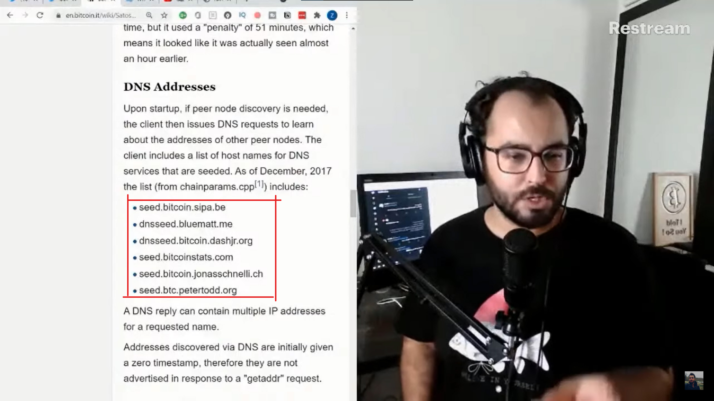

**سوال:** لطفا راجع به نحوه‌ی کار کردن DNS seed و معایبش توضیح بدید. و اینکه اگه اون چند تا داون بشند چه راهکارهایی داریم؟

**ضیا:** ببینید یه چیزی هست به نام node discovery. ما میلیاردها آی پی در سطح اینترنت داریم. از کجا می‌دونیم کدوم یکی مال نود بیت‌کوینه. ما یه شبکه‌ی غیر متمرکز داریم. چجوری نودهای بیت‌کوین همدیگر رو پیدا می‌کنند، به هم وصل میشند و با هم دیگه کار می‌کنند؟

تا حالا سوال پیش نیومده بود براتون؟ یعنی مثلا کل اینترنت رو اسکن می‌کنه و دونه دونه می‌گرده؟ فکرش رو بکنید تک تک درهای خونه‌های دنیا رو بزنید تا مثلا یکیشون رو پیدا کنید که نود بیت‌کوین داره. همچین چیزی رو تصور کنید.

پس یه روشی برای این که نودها همدیگر رو بشناسند و با همدیگه آشنا بشن و به هم متصل بشن و به همدیگه دیتا جابه‌جا کنند باید وجود داشته باشه که بهش میگن node discovery.

در گذشته وقتی ساتوشی بیت‌کوین رو ریلیز کرد یه چیزی داشت که روشش بر اساس IRC Addresses بود. که این روش از نسخه‌ی 0.6x دیگه استفاده نمی‌شد و از 0.82 به بعد اصلا دیگه پاک شد از روی کد بیت‌کوین چون روش خوبی نبود. دلیل اینکه روش خوبی نبود رو می‌تونم تصور کنم ولی هیچ‌وقت نخوندم که چرا. دلیلش رو خودم نمی‌دونم دقیقا.

IRC یه سری فروم و یه سری انجمن‌اند که این انجمن‌ها با پروتکل IRC وجود داره، خیلی هم قدیمی و هاردکور طوراند، از اونایی‌اند که فقط متنه و اصلا یوزرفرندلی نیست. با استانداردهای امروزی افتضاح‌اند.

یه سری فروم‌اند که می‌تونید چت کنید اونجا که خیلی چیزهای فنی لینوکس و گیت‌هاب و کلا پروژه‌های اوپن سورس و بیت‌کوین و زبان‌های برنامه نویسی و... اونجا کامیونیتی دارند و این کامیونیتیشون چون آزاده از IRC server ها استفاده می‌کنند، روی سرورهای free node.

و بیت‌کوین هم اینجوریه، بیت‌کوین هم از free node استفاده می‌کنه. تا همین امروز هم این IRC های بیت‌کوین فعاله و دولوپرهای بیت‌کوین بیشتر اونجا هستند. من معمولا سوالی چیزی که دارم میرم اونجا می‌پرسم.

توی این IRC ها، کسانی که میومدن در مورد بیت‌کوین صحبت می‌کردند و بحث می‌کردند، آی‌پی‌هاشون هر چی که بود، اون آی‌پی‌ها اسکن میشد. چون احتمالا این کاربرهایی که در مورد بیت‌کوین سوال می‌کنند و بحث می‌کنند احتمالا نود بیت‌کوین دارند. پس اینجوری نودهای بیت‌کوین رو پیدا می‌کرد و وصل میشد. این مکانیزم دیسکاوریش بود.

IRC خیلی وقت‌ها داون میشد، اسپم میشد، اتک میشد و... واسه همین خیلی روش قابل اتکایی نبود. بعد یه روشی اضافه شد در آینده که بهش میگن DNS Addresses. این‌ها DNS seed می‌کنند.

توی این لیست 6 تا از این‌ها داریم. این‌ها یه سری سروراند که این‌ها نود بیت‌کوین دارند و شما از این‌ها می‌پرسید که یه لیستی از نودها که بهشون متصل هستید و درست کار می‌کنند رو بهم بده.

ما به 6 تا داریم اتکا می‌کنیم واسه اینکه به ما لیست آی‌پی بدند، یعنی فقط اسم‌ها رو به ما بده و اونوقت ما میریم به اون‌ها وصل میشیم.

و این چندتا توی کد بیت‌کوین هست که این‌ها رو چک کنه. یکیش مال sipa عه. سیپا کیه؟ یکی هست به نام پیتر واله که یکی از توسعه‌دهنده‌های بیت‌کوینه که خیلی معروفه و شناخته شده است. معروفه واسه اینکه سگویت رو اون پیشنهاد داد، خیلی از کارایی که روی بیت‌کوین انجام شده پیشنهادها و مهندسی پیتر واله بوده.

یکی دیگه bluematt عه. مال مت کورالو عه. یکی از جوون‌ترین و پرکارترین توسعه دهنده‌های بیت‌کوینه که اون هم از سن خیلی کم و توی یازده سال اخیر یه سره داشته روی بیت‌کوین کار می‌کرده.

بعدی bitcoin.dashjr هست که ماله لوکه. لوک دش جر، که اون هم یکی از توسعه دهنده‌های بیت‌کوینه.

بعدی bitcoinstats. من اینو یادمه چند سال پیش کلی گشتم تا پیدا کردم که این کیه. این مال آقای کریستین دکر هست که یکی از اشخاصیه که روی لایتنینگ خیلی زیاد کار کرده. طرح‌هایی واسه لایتنینگ داشته و طرح‌هایی هم برای آینده‌ی لایتنینگ داره. پروتوکل L2 رو این شخص داره می‌بره جلو.

بعدی jonasschnelli عه که یکی از مینتینرهای کد بیت‌کوینه و از توسعه دهنده‌هاست.

و petertodd که اون هم یک توسعه دهنده‌ی پرکار و خیلی معروف و شناخته شده توی فضای بیت‌کوینه.

این‌ها چون که نودهاشون همیشه آپه و اشخاص خیلی شناخته شده‌ای هستند، این‌ها رو گذاشتند که وقتی بهشون وصل میشی، لیست 15 تا 16 تا نود رو بهت میده و میگه من به این‌ها متصل هستم و دارم کار می‌کنم، بیا تو هم وصل شو. بعد این جوری نودها رو پیدا می‌کنیم.

سوالی که دوستمون پرسیده بود این بود که اگه این‌ها داون بشه چه بلایی سر شبکه میاد. ببینید شما فقط روز اولی که نودتون رو راه اندازی می‌کنید فقط این مشکل رو دارید، بعد از اون دیگه خودتون متصل شدید به جایی و یه لیستی دارید که رفیقاتون کی‌اند و به کیا وصل بشید.

حالا اگه این‌ها داون بشند، اون روز اول شما چجوری باید راه بیفتی؟ یکی از راهکارها اینه که به جز این‌ها آدم‌های دیگه‌ای هم هستند که DNS server های اینجوری دارند، می‌تونید اون رو جایگزین کنید و به اون‌ها وصل بشید. الزاما این‌ها نباید باشند.

یکی دیگه از راهکارها اینه که شما می‌تونید اصلا برید لیست نود از جاهایی مثل سایت bitnodes.io پیدا کنید. اینجا مثلا ده هزارتا نود رو لیست کرده. میتونید این لیست‌ها رو بردارید و بهشون وصل شید. اصلا شاید دوستی رفیقی دارید که نود بیت‌کوین داره، به اون وصل میشید. آی‌پیش رو برمی‌دارید و بهش کانکت میشید.

یه راهکار دیگه هم اینه که ما یه سری لیست نودهایی که همیشه آنلاین بودند رو هاردکد کردیم توی کد بیت‌کوین، و از این‌ها استفاده نمیشه مگر اینکه بگیم همه‌ی اون قبلی‌ها داون بشه و نتونیم ازشون استفاده کنیم و روش‌های دیگه رو نداشته باشیم.

یعنی داخل خود کد بیت‌کوین این آی‌پی‌ها اضافه شده و به اون‌ها وصل میشیم اگر همه‌ی راهکارهای دیگه جواب ندند.

و یه سری راهکارهای دیگه هم هست که من دقیق یادم نیست چی بودند. کلا روش‌های متفاوتی وجود داره، مثلا یه روشی هست که خودتون رو معرفی می‌کنید تا بقیه بهتون وصل بشند.

من یادمه دو سه سال پیش یه توییت زدم که نودم رو دارم سینک می‌کنم و توجه کنید که به کی وصل شده، مثلا یاشار راشدی که تهران بود، منم تهران بودم، این به خاطر نزدیکی‌ای که بوده، این تشخیص داده که این آی‌پی نزدیکه و بهش وصل شده بوده. خیلی جالب و خنده‌دار بود که دو نفر که توی یه شهر زندگی می‌کنند، همدیگر رو می‌شناسند و در مورد بیت‌کوین صحبت می‌کنند، به همدیگه خود به خود وصل شده بودند.

و روش‌های دیگه. پس ما مجموعه‌ای از روش‌ها رو داریم برای نود دیسکاوری. این روش‌ها همه از یک سیستم استفاده نمی‌کنند و که بگیم این سیستم داون شد و همه چی تموم شد. مثلا DNS ها اومد پایین، یه نود دیسکاوری دیگه داریم که خودت می‌تونی اد کنی. دیگه مثلا میتونی خودت خودت رو ادورتایز کنی که بهت وصل بشند، می‌تونی از نودهای هاردکد توی کد بیت‌کوین استفاده کنی. راهکارهای زیادی هست.
