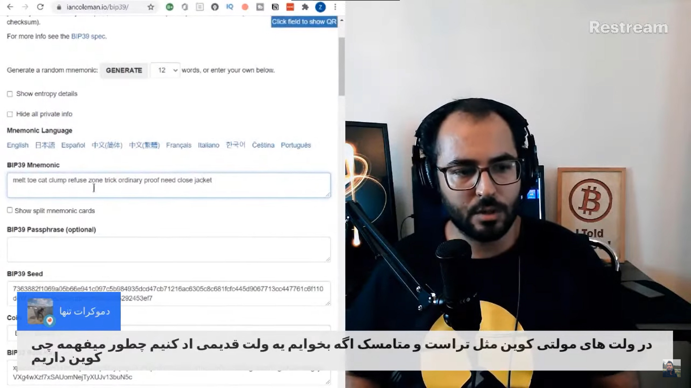
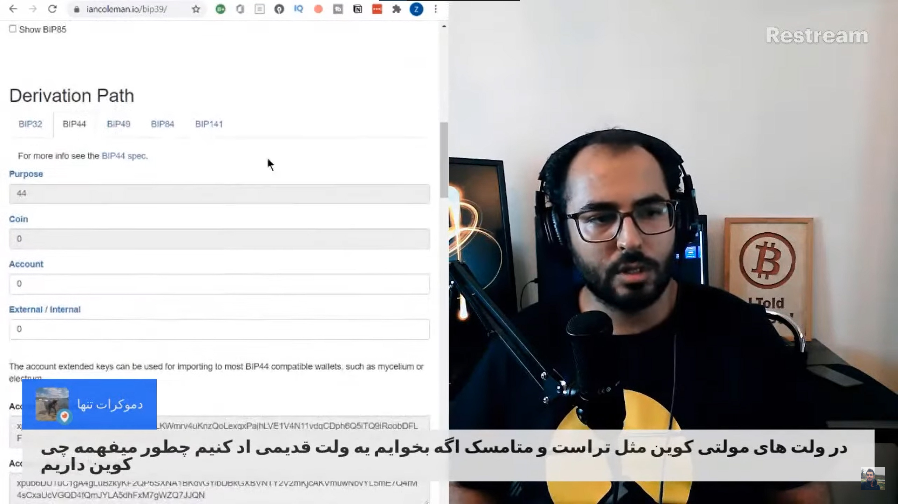
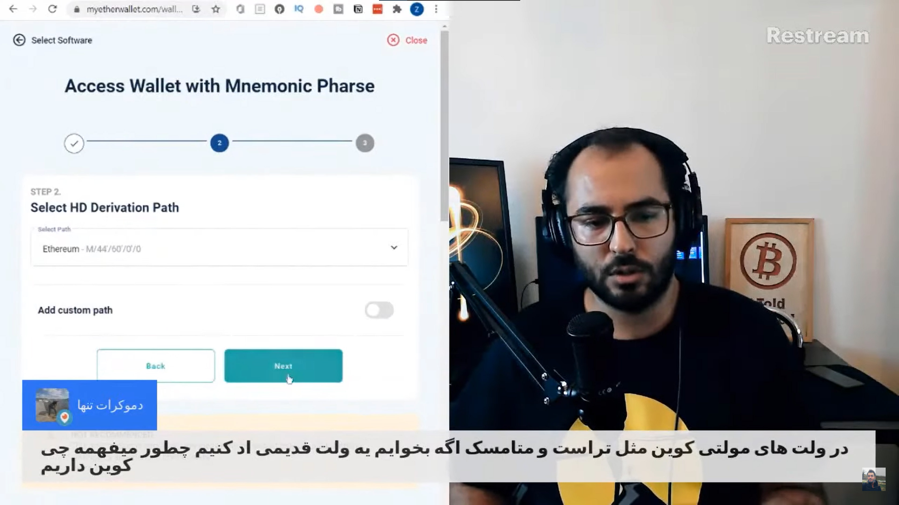

**سوال:** در ولت‌های مولتی کوین مثل تراست و متامسک اگه بخوایم یه ولت قدیمی اد کنیم چطور می‌فهمه چه کوینی داریم؟

**ضیا:** نمیدونم منظورتون دقیقا چیه ولی حدسم اینه که شما میگید که مثلا ما سید یه والت قدیمی رو می‌خوایم توی مثلا تراست والت وارد کنیم. الان که توی تراست والت وارد کردیم از کجا می‌فهمه که همه‌ی این کوین‌ها رو توش دارم؟ چجوری متوجه میشه؟

اینکه اون والت از قبل توسعه دهنده‌هاش وقتی ساختنش گفتند ما این کوین‌ها رو می‌تونیم چک کنیم توی سیدتون که یعنی وقتی سید رو وارد می‌کنید، نرم افزار تراست والت میاد این‌ها رو از توی پراویت‌کی شما چک می‌کنه، نه اینکه آنلاین چک کنه‌ها، نه فقط از توی خود گوشی چک می‌کنه، چک می‌کنه که مثلا آدرس‌های این کوین‌ها رو بساز، بعد اگه موجودی توشون بود که احتمالا هست، طبق والت‌های استاندارد رفتار می‌کنند.

والت‌های استاندارد همه به یک شکل از سید، آدرس تولید می‌کنند. چون همه به یک شکل تولید می‌کنند وقتی کلمات رو وارد می‌کنید، مثلا کوین‌های به عنوان مثال اتریوم رو وقتی می‌برید توی تراست والت، تراست والت متوجه میشه که طبق استاندارد، از این پرایوت‌کی‌ها باید طبق استاندارد m/44/60/00 آدرس‌ها رو تولید کنم.

وقتی طبق این که بهش Derivation Path میگند آدرس‌ها رو تولید کنه برای اتریوم، همون آدرسی رو تولید می‌کنه که لجر شما هم داشت، و توی شبکه‌ی بلاک‌چین چک می‌کنه و می‌بینه که موجودی داره و واسه تک تک کوین‌ها این کار رو انجام میده.

می‌تونم نشونتون بدم. میریم توی سایت iancoleman.io/bip39 و یه سید می‌سازیم. این الان یه سید ساخت و حالا طبق این سید 12 کلمه‌ای که Mnemonic هستش، این سید بیت‌کوین رو تولید کرده، این root key هست و این هم استانداردهای مختلف.

حالا ببینید واسه‌ی بیت‌کوین 44 صفر صفر صفر هست. طبق این روش داره این کدها رو تولید می‌کنه. حالا اگه مثلا این رو به جای بیت‌کوین بذارم اتریوم، دیگه 44 صفر صفر صفر نیست، میشه 44 شصت صفر صفر.

الان آدرس‌ها رو هم این شکلی تولید می‌کنه، اولشون 0x داره.

الان این مثل یه والت تو حالت استاندارد داره این‌ها رو تولید می‌کنه. حالا اگه من این رو بردارم و ببرم توی مثلا myetherwallet.com و توی بخش سافت‌ور، من این رو خیلی توصیه نمی‌کنم و صرفا این واسه آزمایشه، اگه اون کلمات سید رو اینجا بزنم، ببینید M/44/60/0/0، طبق همون استاندارد تولید کرد، حالا وقتی آدرس رو تولید میکنه ببینید اولشون 0x داره. این دقیقا همون آدرسیه که توی سایت قبلی هم تولید کردیم.

دقیقا چون والت می‌دونه که طبق این استاندارد باید سید تولید کنه و می‌بینیم که آدرسی که سایت اول تولید کرد دقیقا مثل ادرسیه که سایت دومی تولید کرد. بعد مثلا اگه والت کوینومی باشه به جای این‌ها حالت کاستوم داره و مثلا به جای m/44/60/0 یه چیز دیگه داشته باشه، اونوقت مشکل پیش میاد و والت شما تشخیصش نمیده.

ولی خب پولت هم سرجاشه و نگرانی نداره. بعد میری چیکار می‌کنی؟ میری مثلا واسه‌ی والت تعریف می‌کنی که این سید رو طبق اون روش تولید کن، از توی سایت کوینومی روش تولید سید رو می‌تونید ببینید، بعد مشکل حل میشه.

حالا بذارید یه کوین دیگه رو امتحان کنیم. مثلا ترون. ترون چجوری تولید میشه؟ m/44/195/0/0.

الان اگه این سید ترونی که اینجا هست رو من بردارم بذارم توی یه والت ترونی، می‌دونه که باید طبق استاندارد ترون، از m/44/195/0/0 استفاده کنه و آدرس تولید کنه.

و این شکلی والت‌ها متوجه میشند. موقع‌هایی که متوجه نمیشه واسه اینه که شما کوین رو اشتباهی به یه شبکه‌ای فرستادی که اصلا اون شبکه یا والت واسه‌ی این کار ساخته نشده. بذارید یه کوین دیگه رو اینجا انتخاب کنم، مثلا اتریوم کلاسیک، عدد این m/44/61/0/0 هست. مثلا اگه اتریوم معمولی رو به آدرس‌های این فرستادید می‌پذیره چون استانداردهاش شبیه به اتریومه، فرقی نمی‌کنه. ولی توی والتتون نشون نمیده.

اونوقت باید چیکار کنیم؟ توی همون سایت myetherwallet دوباره سید رو وارد می‌کنیم و این بار اتریوم کلاسیک رو انتخاب می‌کنیم. حالا طبق استاندارد اتریوم کلاسیک آدرس ساخت. ولی بعدش انتخاب می‌کنید که توی شبکه‌ی اتریوم خرج بشه.

اینجوری اگر اشتباهی موجودی اتریومتون رو فرستادید روی آدرس اتریوم کلاسیک، اینجوری می‌تونید موجودیتون رو روی شبکه‌ی اتریوم دوباره ببینید و بتونید خرجش کنید.

ولی این اتریوم و اتریوم کلاسیک و پالیگان و این‌ها چون استانداردشون شبیه به همه، این کار امکان پذیره. ولی همه اینجوری نیستند. مثلا آدرس‌های ترون یه جور دیگه است. اگه اون رو اشتباه انتقال بدید دیگه تمومه و پولتون از دست رفته، چون اون آدرس اصلا توی شبکه‌ی مقصد کار نمی‌کنه.

حالا خیلی از کوین‌ها اصلا اجازه‌ی ارسال به مقصد اشتباه رو نمیدند ولی بعضی کوین‌ها اینطوری‌اند که هر چیزی که بکوبی روی کیبورد بزنی به عنوان آدرس، قبول می‌کنه و می‌فرسته.

این هم این بود از این که BIP39 چجوری می‌فهمه که آدرس‌ها رو واسه‌ی هر کوین چجوری تولید کنه و بفهمه که اون کوین رو داریم یا نداریم.
