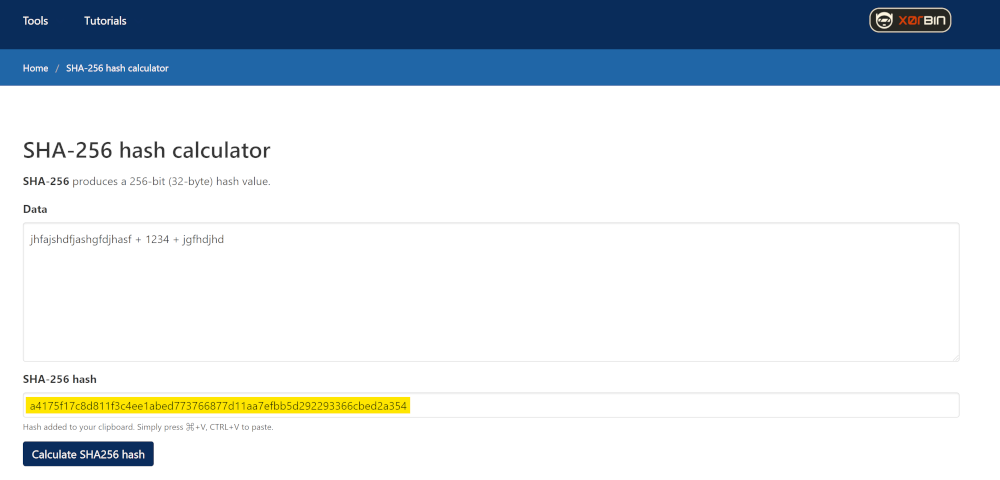

**سوال:** در مورد حل معادلات ریاضی که ماینرها انجام میدند، اون معادلات ریاضی از کجا طرح می‌شه؟ آیا این معادلات قبلا حل شدند؟ جواب این معادلات کجا میره و در دست کی قرار می‌گیره؟

**پاسخ:**
خب این قسمت مرتبط با نحوه‌ی ماینینگیه که توی بیت‌کوین صورت می‌گیره، یعنی اگر شما بخواین پروتکل ماینینگ بیت‌کوین رو متوجه بشید این قسمت به شما جواب می‌ده.

ما توی بیت‌کوین یه سری بلاک داریم شبیه به برگه‌های دفتر حسابداری. هر بلاکی که پیدا می‌شه یه کاغذ به دفترچه اضافه می‌شه. هر سری یه کاغذ اضافه می‌شه و همه‌ی این کاغذها مثل سیمی که این کاغذها رو به همدیگه دوخته، به هم دوخته شدند و پشت سر هم به هم متصل هستند، یعنی هش بلاک قبلی توی بعدی قرار می‌گیره و ماینینگ صورت می‌گیره روی بلاک جدید.

خب این یعنی چی؟ یه ذره پیچیده به نظر میاد. هر بلاکی که پیدا می‌شه یه قسمتی از این بلاک توی بعدی قرار می‌گیره و شروع می‌کنن به کار کردن روی بعدی تا بلاک بعدی پیدا بشه.

این فرآیند باعث می‌شه که زنجیره‌ای از بلاک‌ها شکل بگیره واسه همینه که بهش می‌گن بلاک‌چین. خود ساتوشی بهش می‌گفت تایم‌چین نمی‌گفت بلاک‌چین که بعدا اصطلاح بلاک‌چین مطرح شد.

و اینکه ماینینگ ‌اینجوری عمل می‌کنه. حالا ما دنبال چه جوابی می‌گردیم؟ راستشو بخواین اون جواب، جواب سختی نیست یعنی ما جواب رو از قبل تا حدودی می‌تونیم بگیم می‌دونیم. این جوابی که ما دنبالش می‌گردیم چیه؟

این بلاک یا در واقع همون برگه‌های این دفتر، همه توشون پر از تراکنشه. یک لیست زیادی از تراکنش‌ها چیده شده توی این دفتر. همه‌ی این‌ها از یک تابع رد می‌شن و هش می‌شن، بعلاوه‌ی یک سری چیزها مثل Nonce در واقع یک نوع متغیر و هش بلاک قبلی و یکی دو تا متادیتای دیگه. این‌ها کنار هم از تابع SHA256 می‌گذرن و هش می‌شن.

یه جوابی باید به دست بیاد. من الان اینجا اسکرین‌شِیر می‌کنم که ببینید چه شکلی این هش انجام می‌شه. اینجا محاسبه گر SHA256 عه.

اینجا مثلا ما هش بلاک قبلی رو داریم که می‌شه این. بعد بعلاوه‌ی یه متغییر یا همون Nonce مثلا 1234 که هر سری این عوض می‌شه. بعلاوه‌ی یه سری متادیتای دیگه. این رو اگه هش کنیم یه جوابی به دست میاد. می‌بینید این جواب ماست.

حالا جوابی که توی بیت‌کوین مطرح می‌شه چیه؟ بهش می‌گن Difficulty Target که ممکنه این شکلی باشه. فکر کنم الان روی 18 تا صفریم.

می‌گه که آقا شما این دیتاها رو هش کن، از این تابع بگذرون. این دقیقا شبیه اتفاقیه که توی ماینینگ اتفاق میفته. با همین ماشین حسابا تقریبا دستی می‌شه انجامش داد ولی اون دستگاه‌های ماینینگ خیلی سریع‌تر انجام می‌دن. مثلا 100 تراهش در ثانیه انجام می‌دن. ما اینجا فوقش در دقیقه یکبار بتونیم دستی انجامش بدیم.

اون دستگاه‌ها این عدد متغیر یعنی Nonce رو هی عوضش می‌کنن تا به یه جوابی برسند که اولش تعداد مشخصی صفر داشته باشه. این جوابیه که شبکه از ما می‌خواد.

ببینید معادله‌ی پیچیده‌ای نیست، این رو هش کن و به یه جواب برس که اولش 18 تا صفر باشه. احتمال اتفاق این بسیار پایینه. در هر 10 دقیقه با اون مقدار هش ریت بسیار بالا، در هر دقیقه 150 اگزاهش در کل جهان، 150 اگزاهش یه عدد فوق‌العاده بزرگه، صدها میلیون دلار دستگاه ماینینگ، همه‌ی این‌ها با همدیگه دارن کار می‌کنند، بالاخره یکیشون می‌تونه این عدد رو شانسی پیدا کنه بالاخره. با احتمالات می‌تونیم حدس بزنیم که چقدر طول می‌کشه تا این عدد پیدا بشه.

پس اگر این عدد پیدا شد اونوقت بلاک شما صحیحه و همه‌ی نودها توی شبکه این بلاک رو قبول می‌کنند و می‌ریم صفحه‌ی بعدی دفتر و دوباره همین فرآیند رو انجام می‌دیم. توش تراکنش‌ها رو می‌چینیم. شروع می‌کنیم به هش کردن تا اون جوابه به دست بیاد.

ببینید این یک کار بسیار سخته، بسیار برق مصرف می‌کنه، بسیار زیاد انرژی اینجا مصرف می‌شه، دستگاه‌ها تجهیزات گرون قیمتی نیاز دارند و در سراسر دنیا میلیون‌ها دلار قیمت‌ این تجهیزات هست تا بالاخره هر ده دقیقه یه بار یه دونه از این عدد پیدا بشه.

ولی هدفش چیه؟ ببینید کار بسیار سختیه اما فرآیندش ساده است. یک معادله‌ی پیچیده نیست. از قبل هم طراحی نشده. صرفا دیتای بلاک باید از یه تابع هش فانکشن SHA256 بگذره.

وقتی این عدد پیدا شد چون هزینه‌ی بسیار زیادی واسه پیدا کردن این عدد وجود داشته، کس دیگه‌ای دوباره نمی‌ره این رو تولید کنه و دیتا رو تغییر بده توی بلاک‌چین. که اینجا اگر کسی بخواد همچین سعی و تلاشی بکنه باید توانایی بسیار زیادی داشته باشه، هش ریت بسیار زیاد و دستگاه‌های بسیار زیادی داشته باشه که بتونه اون وقت حمله‌ی Double Spend انجام بده. این در واقع یه مکانیزم برای امن کردن شبکه است.

موضوع خیلی فنیه و من فکر کنم خیلی خوب توضیحش ندادم ولی در کل خلاصه‌اش این می‌شه. معادلات از قبل وجود ندارند، صرفا یه تابع هست که بر اساس قانون احتمالات ما باید به یک جواب مشخصی که از قبل می‌دونیم چقدره، یعنی یک عدد رندم با 18 تا صفر اولش برسیم. این عدد رو اگر بهش برسیم ما در واقع یک بلاک پیدا کردیم و ماینری که این کار رو کرده، پاداشش رو دریافت می‌کنه و همه‌ی ماینر‌ها میرن سراغ بلاک بعدی.
