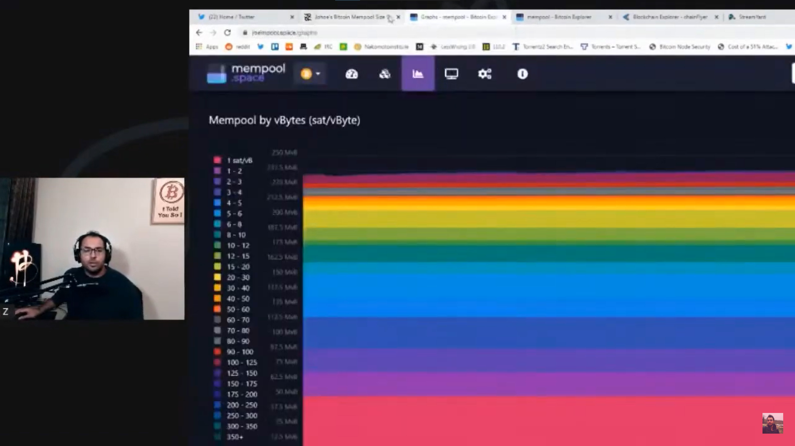
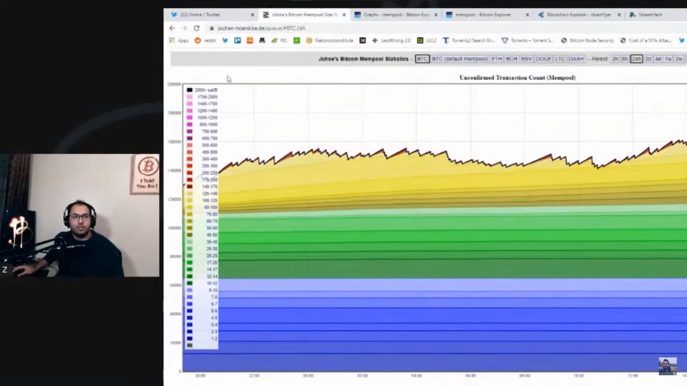
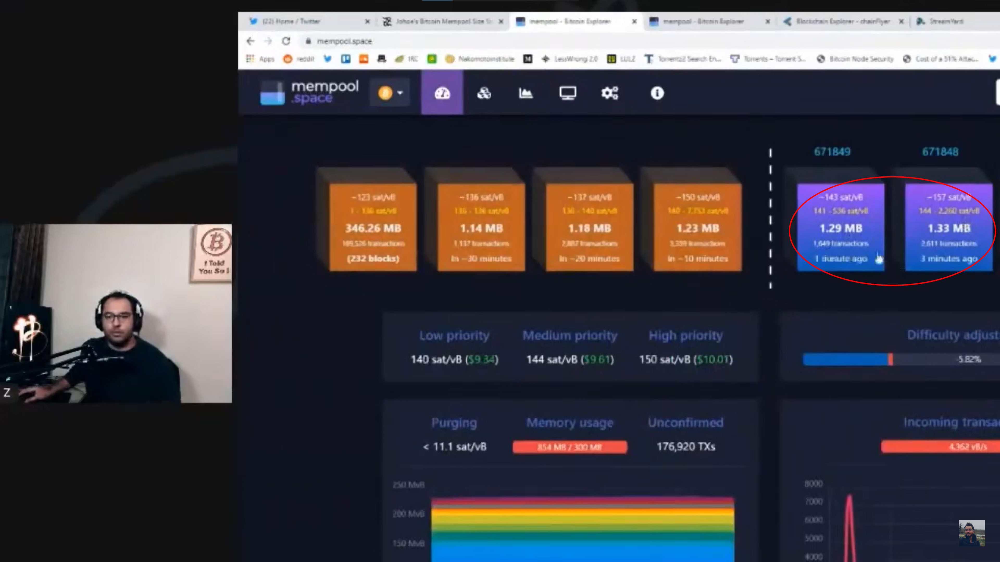
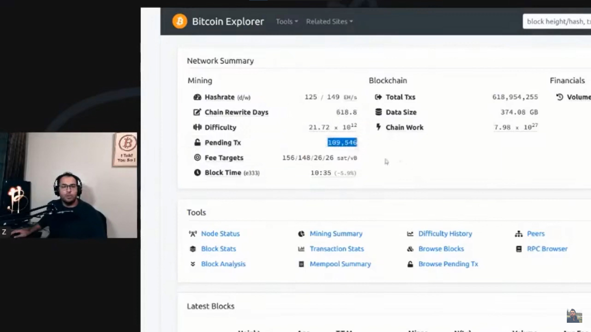
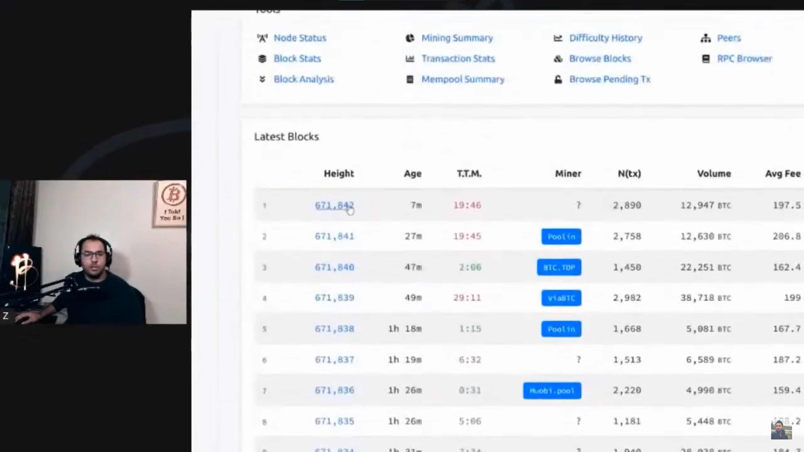

**ضیا:** یکی از دوستان از من پرسیده که ممپول چیه. توی ماجرای بیت‌کوین یا اسمش رو شنیدید یا اگه نشنیده باشید بالاخره این تراکنش‌ها و کارمزدها، همه به این مرتبط می‌شه. بذارید من یه اسکرین شِیر کنم و ممپول رو نشونتون بدم که چجوریه، چه شکلیه و یه مقدار در موردش توضیح بدم. موضوع خیلی جالبیه.

خب الان دو تا تصویر رنگی رو داریم می‌بینیم،

یا تصویرهای دیگه‌ای که می‌تونم نشونتون بدم، همه‌ی این‌ها Mempool Visualizer هستند.

ممپول چیه؟ ببینید شبکه‌ی بیت‌کوین، این قسمت بنفش که می‌بینید بلاک‌چینشه، یعنی بلاک‌هایی که پیدا شده و تراکنش توشون قرار داده شده و تراکنش‌هاشون کانفرم شده.

ولی تراکنش‌هایی که کانفرم نشدند کجان؟ کجا نگهداری می‌شند؟ توی نرم‌افزار بیت‌کوین که در واقع همون نود بیت‌کوین هست، بلاک‌چین نگهداری میشه و تراکنش‌ها ثبت و ضبط می‌شن. اما تراکنش‌هاشی که ثبت و ضبط نشدند توی مموری برنامه می‌مونند تا زمانی که ثبت بشند، یعنی یه ماینر اون‌ها رو برداره و کانفرم کنه.

توی تصویر بالا اون بلاک‌های نارنجی رنگ در واقع تراکنش‌هایی هستند که هنوز کانفرم نشدند. یعنی یه سری تراکنش داخل اون بلاک‌های نارنجی هستند که الان ماینر داره روشون کار می‌کنه و وقتی بلاک پیدا شد میره سمت راست اضافه می‌شه.

من الان نود خودم رو اینجا روی Tor باز می‌کنم. این در واقع نود پشت Tor هست و به شکل سایت .com نمیشه بهش دسترسی پیدا کرد. الان دارم چک می‌کنم 109546 تراکنش توی ممپول نود من وجود داره و این تراکنش‌هاییه که هنوز کانفرم نشده.

اما تراکنش‌هایی که کانفرم شدند اینجا توی بلاک‌های اخیری که پیدا شدند دونه دونه قرار می‌گیرند. مثل یه دفتر حسابداری که مثلا این‌ها هر کدوم یک صفحه از دفتر حسابداریه و اون‌ها هم تراکنش‌هاییه که قراره اون حسابدار که همون ماینره، بنویسه توی بلاک و ثبتشون کنه و به بلاک‌چین اضافه کنه.

پس این تراکنش‌ها الان توی ممپول منتظراند و اگه امروز یا دیروز تراکنش کانفرم نشده‌ای دارید، بین این‌ها هست.

ممپول چه شکلیه؟ الان اینجا یه چارت قشنگ نشون داده که تراکنش‌ها رو بر اساس نرخ کارمزدی که پرداخت کردند طبقه بندی کرده.

سمت چپ تصویر این‌ها نرخ کارمزدهاست. مثلا یک ساتوشی، دو ساتوشی و... و همینطور که میریم پایین نرخ‌های بالاتر، و وسط این چارت حجم تراکنش‌ها رو نشون می‌ده.

اولویت در انتخاب تراکنش با کارمزد بالاتره یعنی هر تراکنشی که کارمزد بالاتری داشته باشه، که توی تصویر اون طبقه‌ی خیلی باریک بالایی هستن، که کارمزدشون مثلا 100 یا 200 ساتوشی پِر بایته. و همینطوری میایم پایین و مثلا 20 ساتوشی پِر بایت، 10 ساتوشی پِر بایت و همینطور کمتر تا می‌رسیم به اون ردیف قرمز رنگ پایین که میشه 1 ساتوشی پِر بایت، یعنی پایین‌ترین مقدار کارمزد.

یه دونه Visualizer دیگه رو هم ببینیم. این جالب‌تر نشون داده.

آبی رنگ‌ها کارمزدشون خیلی کمه و هر چی میره بالاتر کارمزدها بیشتر می‌شه و اون قرمزهای بالا خیلی کارمزد بالایی دارند.

الان اگه بخواد تراکنش‌ها کانفرم بشه، اون قسمت قرمز بالای چارت زودتر کانفرم میشن، چون خیلی کارمزد بالایی دادن در مقایسه با بقیه. بعد وقتی که قرمزها کانفرم شدند، ماینر میاد سراغ قسمت زرد رنگ، بعد سبز و بعد آبی.

این ممپول شناوره و دائم بهش تراکنش اضافه میشه و تراکنش تلمبار میشه داخلش و ماینرها از اون طرف دائم با پیدا کردن بلاک‌ها تراکنش‌ها رو کانفرم می‌کنند.

پس اگه مثلا یه تراکنش با کارمزد کم تو قسمت آبی رنگ باشه چجوری کانفرم می‌شه؟ فکرش رو بکنید که همیشه تراکنش با کارمزد بالا به ممپول اضافه بشه و نوبت به تراکنش‌ها با کارمزد کم نرسه. پس چجوری اون‌ها کانفرم میشند؟

توی تایم‌های شلوغی شبکه اصولا بیشتر از هر چیزی تراکنش‌هایی که کارمزد بالایی میدن کانفرم میشن. وقتی که شبکه یه مقدار خلوت‌تر میشه اونوقت ماینرها قسمت‌های پایینی رو هم کانفرم می‌کنن. چرا؟ چون دیگه تراکنشی با کارمزد بالا نیست، ولی خب، بیشتر طول میکشند.

اگه تو بخش قرمز باشید، شاید 10 دقیقه، 20 دقیقه بعد، تراکنشتون کانفرم بشه. اما اگه توی قسمت‌های پایینی باشید ممکنه مثلا 2 ساعت یا مثلا 8 ساعت یا مثلا دو سه روز طول بکشه. بستگی به شلوغی شبکه داره.

این موضوع خیلی گنگ بوده واسه همه که این ممپول چه شکلیه و چه شکلی کار می‌کنه و چرا تراکنش‌ها انقدر طول میکشه تا کانفرم بشن، که طبق این چارت‌هایی که الان دیدیم که در واقع مقدار تراکنش‌ها در حافظه‌ی نود بیت‌کوین هستند، میشه دید که کدوم چقدر کارمزد دادن و ماینرها بر اساس اولویت از بالا شروع میکنند و تراکنش‌ها رو کانفرم می‌کنند.

و خلاصه ممپول این شکلی کار می‌کنه، و شبکه‌ی بیت‌کوین به طور کلی این شکلی کار می‌کنه و اگه کارمزدها زیاده پس باید حتما یاد بگیرید و بتونید مدیریت کنید که چه مقدار کارمزد نیاز دارید انتخاب کنید و چه مقدار نیاز دارید پرداخت کنید. مثل دوست من که امروز بهم گفت که یه مقداری بیت‌کوین واسه من بفرست می‌خوام برم مثلا وی پی ان بخرم، و من واسش فرستادم و از اونجایی هم که هیچ عجله‌ای برای خرید نداشت، با کارمزد خیلی پایینی پرداخت کردم.

اگر عجله دارید و این پول باید سریعا به مقصد برسه که شما مثلا معامله‌ای می‌خواین انجام بدید، ماشین بخرید، تریدر هستید می‌خواین سریعا بیت‌کوین بفرستید توی اکسچنج نقدش کنید و... و کلا عجله دارید، باید کارمزد بالا پرداخت کنید.

اگر شما مثلا کارمزد رو پایین پرداخت کرده باشید و توی ممپول گیر کرده باشه و الان واسه شما عجله ایجاد شده، بهتره که از قبل شما کیف پول خوبی داشته باشید که بتونه این قسمت رو مدیریت کنه. کیف پول‌هایی مثل بلووالت، الکترام، سامورایی والت، گرین والت و خیلی از کیف پول‌های دیگه الان هستند که قابلیت rbf رو دارند و با اون قابلیت می‌تونید کارمزد رو بعد از ارسال تراکنش، افزایش بدید و تراکنش رو از توی ممپول جایگزین کنید با یه تراکنش جدیدی که کارمزد بالاتری داره.

به این شکل می‌تونید مدیریت کنید و کارمزد اضافه پرداخت نکنید. به اون مقدار که عجله و اولویت دارید، عجله‌ی کم کارمزد پایین و عجله‌ی زیاد کارمزد بالا انتخاب کنید.
